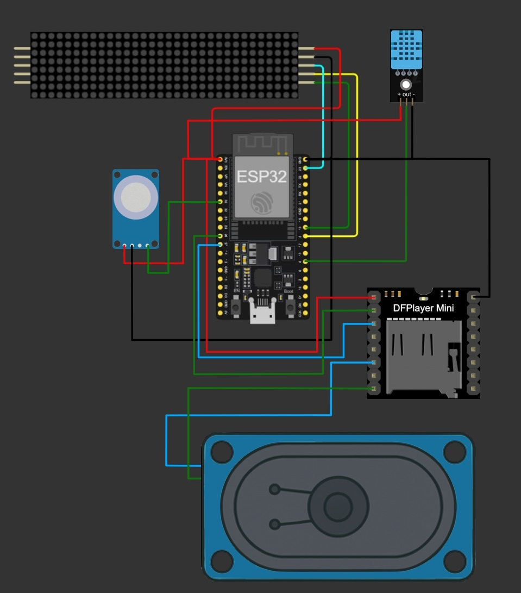

Короткий опис проєкту:

ХроноПанель - це розумний годинник на основі плати ESP32 з такими функціональними можливостями:
*показ часу
*слідкування за статусом тривоги в Кіровоградській області (голосове і текстове повідомлення про початок тривоги і відбій) 
*моніторинг початку і кінця перерви на локації (голосове і текстове повідомлення)
*температурний контроль (голосове і текстове повідомлення про ввімкнення і вимкнення обігрівача)
*моніторинг якості повітря (голосове і текстове повідомлення про провітрення аудиторії)
*показ випадкових повідомлень

Інструкція по запуску:

1. Завантажити і розархівувати папку проєкту
2. Відкрити виконуваний файл  .ino в середовищі Arduino IDE (версія не старіша за 2.0)
3. Через менеджер бібліотек встановити наступні бібліотеки: 
MD_Parola
MD_MAX72xx.h>
DHTesp.h
ArduinoJson
DFRobotDFPlayerMini
4. У Tools обрати плату ESP32 DevModule
5. Завантажити скетч, підімкнувши годинник через відповідний роз'єм
6. Подати живлення на годинник через USB

Алгоритм дій, щоб змінити область для відслідкування статуси тривоги:

1. Перейти на сайт https://devs.alerts.in.ua/
2. Знайти пункт "Location UID"
3. У списку знайти унікальний індетифікатор своєї області
4. У файлі setting.h знайти рядок 
const char* apiUrl = "https://api.alerts.in.ua/v1/iot/active_air_raid_alerts/15.json";
і замінити "15" на код своєї області 

Схема підключення

